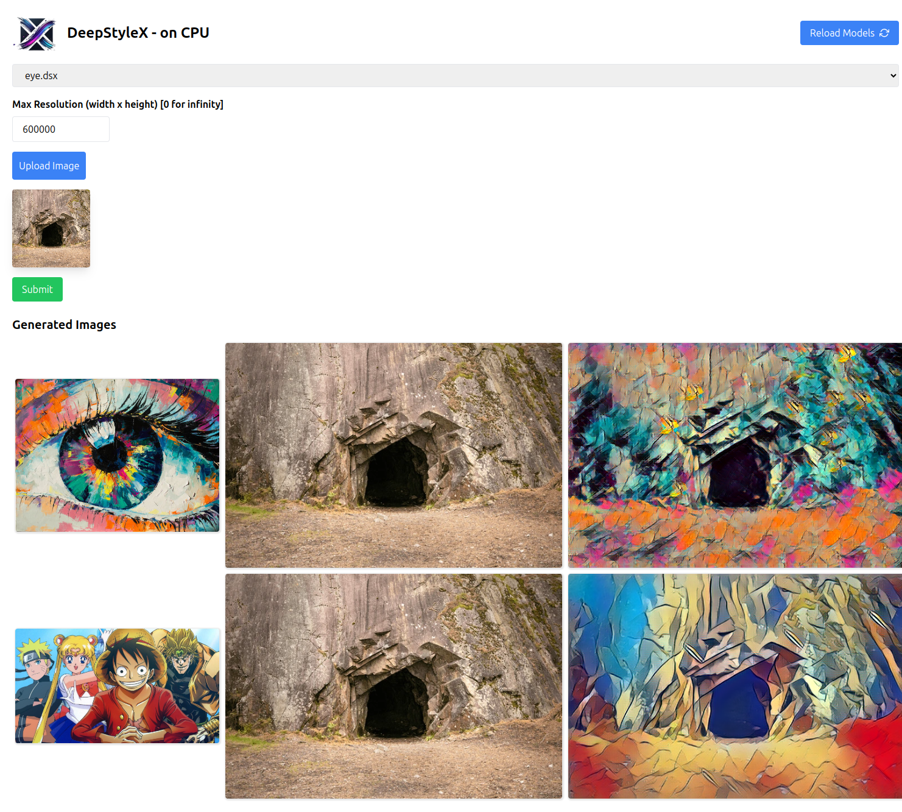

<h1 align="center">
  
  <br>
  DeepStyleX
</h1>

**DeepStyleX** is an image transformation family of models that applies a style to the image.
This model is inspired from these two papers: 

- [Perceptual Losses for Real-Time Style Transfer and Super-Resolution](https://arxiv.org/abs/1603.08155)
- [Instance Normalization: The Missing Ingredient for Fast Stylization](https://arxiv.org/pdf/1607.08022)

> [!TIP]
> This project contains a **Web UI** to make it easy to use. For more information, reffer to this [section](#web-app).

> [!IMPORTANT]
> There is a suit of pretrained models, reffer to this [section](#download-pretrained-models).

## Getting started
```bash
python3 -m venv .venv
source .venv/bin/activate
```

To install the dependencies:
```bash
pip install -r requirements.txt
```

If it doesn't work, try
```bash
pip install torch pillow torchvision numpy tqdm pillow opencv-python

# For web-app
pip install fastapi python-multipart uvicorn
```


## Example use case
### Train
```bash
python3 scripts/model-cli.py train --dataset data/scenes/Coco/ --epochs 4 --style-path data/style/leaf-style.jpg --resume-path data/saves/model1.pth --output-path data/saves/model1.pth --checkpoint-dir data/check/ --checkpoint-interval 200
```

### Test
```bash
python3 scripts/model-cli.py eval --model-path data/saves/model1.pth --input-image data/Central-Park.jpg --output-image output/central-leaf.jpg 
```

### Web app
Launch the server
```bash
uvicorn scripts.api:app --reload --port 8080
```



> Note: Your models should be in `data/saves/` in order to be used in the web app


### Download pretrained models
To download pretrained models, just run this python script:

```bash
python3 scripts/download-models.py 
```
